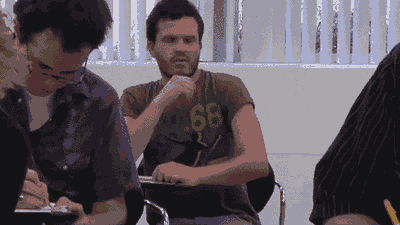

# Hackathon: maak eigen website met HTML/CSS

Je gaat nu jouw (nieuw geleerde) skills bundelen. Je gaat tijdens deze hackathon alle onderwerpen van dit blok toepassen en ontdekken hoeveel je al hebt geleerd.

## Doel van de hackathon:

Jouw HTML/CSS kennis bundelen tot een website waar je trots op bent.

**Let op! Neem op tijd pauze**

## Minimum vereisten

Zorg dat jouw website de volgende eigenschappen heeft, meer mag natuurlijk altijd!

- Gebruik een **duidelijk onderwerp** voor jouw website: "mijn website gaat over... "
- Gebruik meerdere pagina's in jouw website.
- Gebruik minstens 5 verschillende HTML elementen.
- Gebruik semantische HTML elementen op de juiste plaatsen met de juiste betekenis.
- Gebruik CSS in een losse stylesheet (gebruik **geen** inline CSS = CSS in de HTML & gebruik geen CSS frameworks).
- Gebruik minstens op 2 plekken, padding margin of borders op jouw website. Met andere woorden: laat aan ons zien dat jij het box-model onder de knie hebt.
- Gebruik minstens 1 plaatje.
- Gebruik minstens 2 links.
- Gebruik MediaQueries, zodat je website er **anders** uit ziet op mobiel en op desktop.
- Gebruik CSS-grid om een layout te maken en al je elementen op de pagina te positioneren (heb jij geen CSS Grid gehad hiervoor: dan is dit punt **niet** verplicht)
- Gebruik flex-box om elementen te positioneren.
  (heb jij geen flex-box gehad hiervoor: dan is dit punt niet verplicht)
- Gebruik minstens 1 formulier op jouw website.
- Jouw website is **mobile-first**. De basis CSS is voor een mobiele telefoon, de extra CSS voor op desktop staat in een media-query.
- We kijken ook naar de netheid: zorg dus dat alle "spelfoutjes" uit je code zijn (gebruik een linter).
- Zorg daarnaast dat je code juiste geformatteerd is. Gebruik spaties en enters op de juiste manier.

## Bonus-features

Als dit allemaal naar meer smaakt en je wil meer doen voeg dan ook de volgende dingen toe aan je website:

- Gebruik een embedded YouTube video.
- Gebruik veel mooie afbeeldingen, bijvoorbeeld van stockfoto websites.
- Gebruik ook een design en gebruik media-queries voor andere screen-sizes, denk aan: tablet.
- Gebruik mooie op elkaar afgestemde kleuren.
- Gebruik externe libraries zoals Google Fonts, om extra CSS aan je website toe te voegen.
- Gebruik een uitgebreid formulier met veel verschillende soorten inputvelden.
