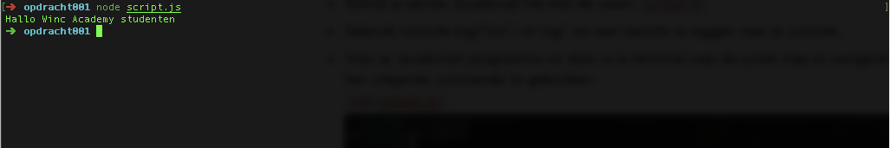

# JS programma draaien op jouw computer + comments maken

We gaan een stukje JavaScript uitvoeren "op de computer". Dat doe je met Node. Dat betekent dat de JavaScript **niet** wordt uitgevoerd in de browser, maar op jouw computersysteem. We hebben Node geïnstalleerd.

## Waarom opdrachten met Node?

We gaan aandachtig stukken JavaScript bestuderen, daarom gaan we puur naar JavaScript kijken, zonder dat daar een browser aan te pas komt als tussenpersoon. Zo heb je zo min mogelijk "ruis" bij het leren.

## Deel 1:

Maak een nieuwe map met de opdracht, maar! kopieer niet de inhoud van de voorgaande opdracht.

- Maak een JavaScript file met de naam: `script.js`
- Schrijf `console.log("Hallo Winc Academy studenten")` in de file

> console.log("Hallo Winc Academy Studenten")

- Voer je JavaScript programma uit door in je terminal naar de juiste map te navigeren (W1D2-3). Gebruik daarvoor je nieuw verworven `cd` en `ls` skills.
  - Wanneer je je in de **juiste map** bevindt, voer het onderstaande commando uit: **_node script.js_** 

Let op! In dit screenshot zie je dat ik naar opdracht001 ben genavigeerd. In jouw geval gaat dat natuurlijk de map W1D2-3 zijn met daarin de file script.js.

## Deel 2:

Je weet nu hoe je een JavaScript file kunt runnen op je computer. We gaan nu aan de slag met de volgende opdrachten. Run elke keer je code en check het resultaat.

1. Bereken de uitkomst van 1230941 x 1823794 en log de uitkomst naar de console (in dit geval jouw terminal).
2. Bereken de uitkomst van 637263 / 54 en log de uitkomst naar de console (in dit geval jouw terminal).
3. Gebruik een **regel comment** in je code. Schrijf boven het 1ste sommetje "Dit is een grote som".
4. Run je code met node. Zie je de uitkomst van je comment in de console? Zo ja, waarom? Zo nee, waarom niet?
5. Gebruik een **blok comment** om de 2 voorgaande rekensommen in 1 comment te zetten. Op deze manier zet je deze regels code "uit".
6. Run je code opnieuw met node. Zie je de uitkomst van de som nu nog steeds in de console? Waarom wel/niet?

# // Let op: runt JavaScript in Node? Dan is je terminal de console.

# // Runt JavaScript in je browser? Dan vind je de console in je developer tools.
