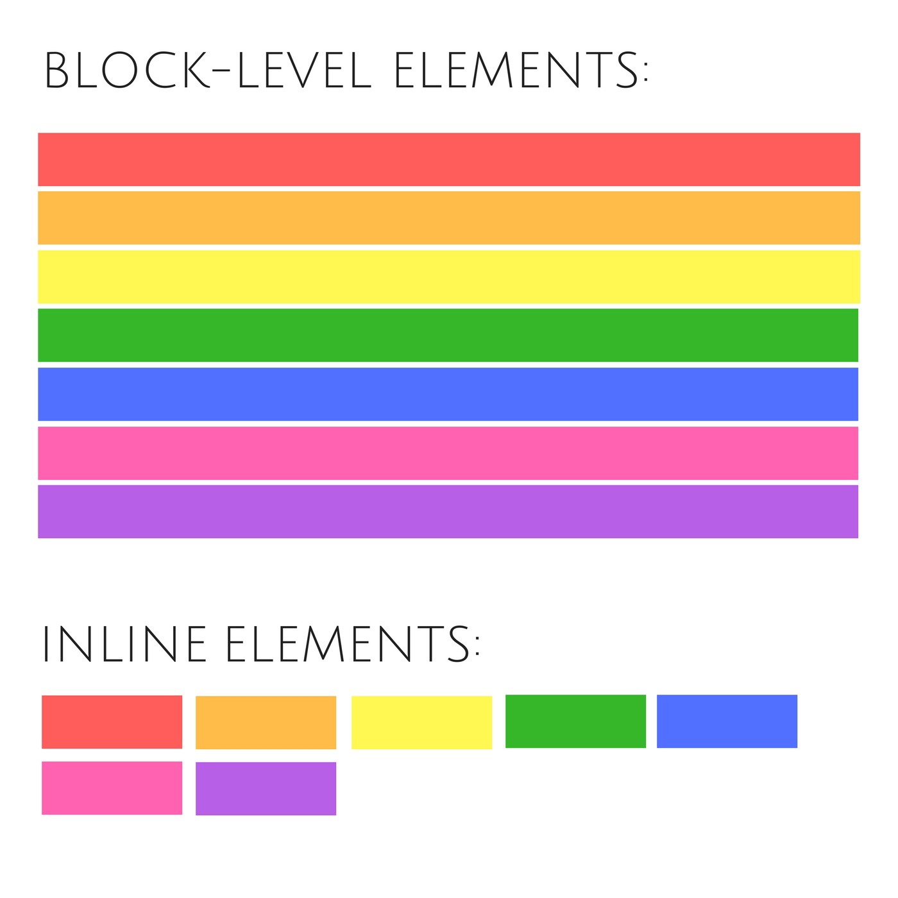

# Opdracht - CSS Box Model

## Introductie

Je gaat de eigenschappen van het Box Model toepassen op de elementen op jouw website. Misschien heb je dat stiekem zelfs al een keer gedaan toen je jouw borders een kleur gaf.

## Deel 1:

1. pak je pen en papier en teken voor jezelf het box-model.
2. Nee maar echt, doe dit even, want het helpt voor je begrip.

## Deel 2:

1. geef je semantic elements (&lt;main&gt;, &lt;header&gt; ) allemaal een mooie gekleurde border
2. gebruik `margin` en zorg dat de elementen in je pagina op een mooie afstand van elkaar staan, niet te dichtbij, maar ook niet te ver.
3. zorg dat de `padding` van je teksten goed is.
4. Gebruik een andere padding voor top & bottom en left & right. Gebruik eerst de uitgebreide CSS notatie en daarna de "shorthand" notatie. e.g: padding: top, right, bottom left.
5. Centreer een element dmv `margin: 0 auto`. Gebruik je naslagwerk en Google
   1. Het gecentreerde element heeft naast margin nog een andere property nodig om zichzelf te kunnen centreren. Weet jij welke? \*zie antwoord onderaan

## Deel 3: inline vs blocklevel elementen

Sommige HTML elementen hebben "van nature" al vaste waardes die met het Box-model te maken hebben. Zo heeft een h1 al een vaste margins. Op deze manier is een HTML element ook altijd "van nature" een blok-level element of een inline-element.

**block-level element**: ik gedraag mij als een pagina-breed blok. **inline element**: ik gedraag mij als een onderdeel van een paragraafje en neem alleen zoveel ruimte als ik nodig hebt voor mijn breedte.

- Een plaatje te verduidelijking:
  

**To do**:

1. maak in je `&lt;nav&gt;` een lijst, dmv een `&lt;ul&gt;`
2. elk item `li` is een link naar een andere pagina, dus in elke `li` zit een link.
3. Gebruik de `display` property van CSS zodat de lijst horizontaal is en niet verticaal. Lees meer over de display property en hoe je die kunt gebruiken via [deze link](https://www.w3schools.com/css/css_navbar.asp).
4. Wanneer je de element selector hebt gebruikt, zul je zien dat alle lijstjes op je pagina nu horizontaal staan. Gebruik een class selector, om alleen de `ul` in de navigatie te selecteren.

**\*Antwoord: width-property**
